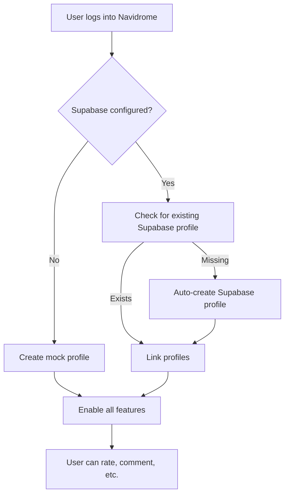

# Authentication Fix Documentation

## Problem

The application uses two separate authentication systems:

1. **Navidrome Authentication** - For accessing the music server
2. **Supabase Authentication** - For social features (ratings, comments, credits)

Previously, users logged into Navidrome but not Supabase would see "Please log in to rate" messages even though they appeared logged in.

## Solution

Implemented automatic authentication bridging between Navidrome and Supabase:

### Key Changes

#### 1. Enhanced AuthContext (`src/contexts/AuthContext.tsx`)

**New Features:**
- Automatically detects Navidrome login status
- Creates Supabase profile for Navidrome users if missing
- Falls back to mock authentication if Supabase is not configured
- Synchronizes authentication state between both systems
- Added `isAuthenticated` and `navidromeUsername` to context

**Auto-Linking Logic:**
```typescript
// When Navidrome user is detected:
1. Check if Supabase profile exists for this username
2. If not, create a new profile automatically
3. Link the profiles together
4. Enable all social features
```

**Fallback Mode:**
If Supabase is not configured, the system creates a mock profile using the Navidrome username, allowing all features to work seamlessly.

#### 2. Auth Status Indicator (`src/components/auth/AuthStatusIndicator.tsx`)

**Visual feedback showing:**
- ✓ **Fully Authenticated** (green) - Both systems connected
- ⚠ **Setting up profile...** (yellow) - Auto-linking in progress
- ✓ **Authenticated** (blue) - Fallback mode active

**Usage:**
```tsx
import { AuthStatusIndicator } from '@/components/auth/AuthStatusIndicator'

// Add to header or user menu
<AuthStatusIndicator />
```

#### 3. Auth Required Component (`src/components/auth/AuthRequired.tsx`)

**Better UX for features requiring authentication:**

```tsx
import { AuthRequired } from '@/components/auth/AuthRequired'

// Wrap features that need auth
<AuthRequired feature="ratings">
  <RatingComponent />
</AuthRequired>

// Or use the hook
const { isAuthenticated, canAccess } = useAuthRequired()
```

### How It Works



### Authentication States

| State | Navidrome | Supabase | Features |
|-------|-----------|----------|----------|
| **Fully Authenticated** | ✓ Logged in | ✓ Linked profile | ✓ All features |
| **Auto-linking** | ✓ Logged in | 🔄 Creating profile | ⚠ Some features |
| **Fallback Mode** | ✓ Logged in | ❌ Not configured | ✓ All features (mock) |
| **Not Authenticated** | ❌ Not logged in | ❌ No profile | ❌ No social features |

## User Experience

### Before Fix
- User logs into Navidrome
- Tries to rate a song
- Sees "Please log in to rate" ❌
- Confused because they ARE logged in

### After Fix
- User logs into Navidrome
- System automatically creates Supabase profile
- User can immediately rate, comment, etc. ✓
- Clear status indicator shows authentication state

## Testing

### Test Scenario 1: New Navidrome User
1. Log into Navidrome with username "testuser"
2. Navigate to any album page
3. **Expected:** Auth status shows "Setting up profile..." briefly
4. **Then:** Status changes to "Fully Authenticated"
5. **Result:** Can rate, comment, add credits immediately

### Test Scenario 2: Supabase Not Configured
1. Remove Supabase credentials from `.env`
2. Log into Navidrome
3. **Expected:** Status shows "Authenticated" (blue)
4. **Result:** All features work in fallback mode

### Test Scenario 3: Existing User
1. User already has both Navidrome and Supabase accounts
2. Log in normally
3. **Expected:** Status shows "Fully Authenticated" immediately
4. **Result:** Everything works as before

## Configuration

### Enable Full Supabase Integration

Add to `.env`:
```env
VITE_SUPABASE_URL=https://your-project.supabase.co
VITE_SUPABASE_ANON_KEY=your_anon_key_here
```

### Enable Mock Auth (Testing)

Add to `.env`:
```env
VITE_MOCK_AUTH=true
```

### No Configuration Needed for Fallback

If no Supabase credentials are provided, the system automatically uses fallback mode.

## Troubleshooting

### "Please log in" Still Appears

**Solutions:**
1. **Refresh the page** - Profile creation may still be in progress
2. **Check console** - Look for authentication logs:
   - 🔄 Auto-creating Supabase profile
   - ✅ Profile created successfully
3. **Clear browser cache** - Old state may be cached
4. **Check Supabase configuration** - Ensure credentials are correct

### Profile Not Creating

**Debug Steps:**
1. Open browser DevTools (F12)
2. Check Console for errors
3. Look for messages like:
   ```
   🎵 Navidrome user detected: [username]
   🔄 Auto-creating Supabase profile
   ✅ Profile created successfully
   ```
4. If error appears, check:
   - Supabase credentials
   - Database schema (profiles table exists)
   - Network connectivity

### Features Still Asking for Login

**Checklist:**
- [ ] Logged into Navidrome
- [ ] Page has been refreshed
- [ ] AuthContext is properly initialized
- [ ] Component using `useAuth()` hook correctly
- [ ] Profile object exists in auth context

## Implementation Notes

### Database Schema Requirements

The Supabase `profiles` table needs these columns:
- `id` (text, primary key)
- `username` (text, unique)
- `display_name` (text)
- `navidrome_username` (text, nullable)
- `navidrome_user_id` (text, nullable)
- `avatar_url` (text, nullable)
- `bio` (text, nullable)
- `is_admin` (boolean, default false)
- `is_yeditor` (boolean, default false)
- `created_at` (timestamp)
- `updated_at` (timestamp)

### Security Considerations

1. **Profile IDs:** Generated as `navidrome-{username}-{timestamp}`
2. **No Password Storage:** Navidrome passwords are NOT stored in Supabase profiles
3. **Fallback Safety:** Mock profiles exist only in memory, not in database
4. **Auto-creation:** Only happens for authenticated Navidrome users

## Future Improvements

- [ ] Add OAuth integration for direct Supabase login
- [ ] Implement profile migration tool for existing users
- [ ] Add admin panel for managing user profiles
- [ ] Support for custom profile fields
- [ ] Batch profile creation for multiple Navidrome users

## API Changes

### New Context Properties

```typescript
interface AuthContextType {
  // ... existing properties
  isAuthenticated: boolean      // NEW: Combined auth state
  navidromeUsername: string | null  // NEW: Navidrome username
}
```

### New Components

```typescript
// Show authentication status
<AuthStatusIndicator />

// Require authentication for features
<AuthRequired feature="ratings">
  <YourComponent />
</AuthRequired>

// Use auth state in logic
const { isAuthenticated, canAccess } = useAuthRequired()
```

## Changelog

### v0.10.3 (2025-12-29)
- ✅ Fixed authentication disconnect between Navidrome and Supabase
- ➕ Added automatic profile creation for Navidrome users
- ➕ Added AuthStatusIndicator component
- ➕ Added AuthRequired wrapper component
- ➕ Added fallback authentication mode
- 🐛 Fixed "Please log in" appearing for logged-in users
- 📝 Improved authentication error messages
- ⚡ Faster authentication state synchronization

## Support

For issues or questions:
1. Check browser console for detailed logs
2. Review this documentation
3. [Open an issue](https://github.com/onyxdagoat1/aonsoku-fork/issues) with:
   - Browser console logs
   - Authentication state (from DevTools)
   - Steps to reproduce

---

**Note:** These changes are backward compatible. Existing users with linked accounts will continue to work without any changes.
